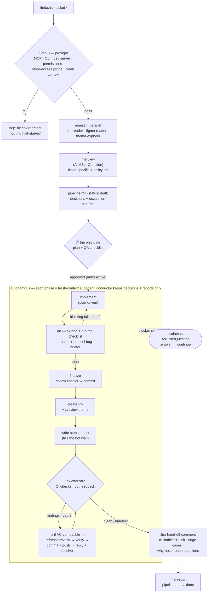

# Foundation — Claude Code plugin

Domaine's **Agentic Assisted Development** skills for Claude Code, packaged as a
plugin. It bundles the Foundation workflow skills (technical approach → develop →
QA → PR, plus translations, breaking-changes, preview themes, etc.) for Shopify
theme work.

## What's inside

This repo is a **marketplace** (a catalog) that hosts one or more **plugins**, each
in its own subfolder under `plugins/`:

```
.
├── .claude-plugin/
│   └── marketplace.json         # marketplace catalog (lists the plugins)
├── plugins/
│   └── fnd/                      # the Foundation plugin (self-contained)
│       ├── .claude-plugin/
│       │   └── plugin.json       # plugin manifest (+ bundled mcpServers)
│       ├── skills/               # 16 workflow skills (see table below)
│       │   ├── develop-feature-or-fix/SKILL.md
│       │   └── ...
│       ├── agents/               # subagents the skills delegate to
│       │   ├── change-reviewer.md   #  reviews a diff (hygiene + conformance)
│       │   ├── bug-hunter.md        #  adversarial bug hunt on a diff (correctness)
│       │   ├── jira-reader.md       #  reads a ticket → structured fields
│       │   ├── jira-writer.md       #  writes one approved field/comment (ADF) → Jira
│       │   ├── figma-reader.md      #  reads one Figma frame → build spec
│       │   └── theme-explorer.md    #  scouts the theme → impact map
│       ├── hooks/                # injected conventions + git guards + context monitor
│       │   ├── comment-discipline.md
│       │   ├── lean-code.md      #  "lazy senior dev" ladder (FND_LEAN=0 to disable)
│       │   ├── subagent-conventions.sh  # injects the above into code-writing subagents
│       │   ├── no-verify-bypass.sh      # PreToolUse guard: no hook-bypassing commits
│       │   └── ...               # see "Hooks" below for the full set
│       ├── scripts/              # bundled runners the skills call
│       │   ├── shopify-admin-gql.sh #  Admin GraphQL (store execute → token)
│       │   ├── theme-json.sh        #  theme JSON / customizer state
│       │   └── ...
│       └── references/           # shared docs the skills read
│           ├── jira-custom-fields.md
│           ├── review-flow.md    #  shared contract for the review/marker flow
│           └── ...
├── tests/                        # committed test suites for the hooks + scripts
│   ├── no-verify-bypass-matrix.sh   #  FP/FN contract of the two commit guards
│   ├── hooks-sim.sh                 #  SessionStart / monitor-gate / context-stats sims
│   ├── scripts-sim.sh               #  runner + theme-json + converter-caller sims
│   └── adf-md-fixtures.mjs          #  ADF ↔ markdown converter fixtures
├── LICENSE
└── README.md
```

To add another plugin later: create `plugins/<name>/` (with its own
`.claude-plugin/plugin.json`) and add an entry to `marketplace.json` → `plugins[]`.

> **Note on rules.** Project coding conventions (`css-conventions`,
> `liquid-conventions`, `protected-core`, …) are **not** shipped in this plugin.
> They live in the target repo under `.claude/rules/*.md` and auto-attach
> natively by their `paths:` globs when you edit matching files. The skills just
> say "follow the repo's coding rules" — the rules themselves come from the
> project. See [Skills + project rules](#how-global-skills-use-project-rules).

## Skills

| Skill | Invoke |
|-------|--------|
| `write-technical-approach`        | `/fnd:write-technical-approach` |
| `develop-feature-or-fix`          | `/fnd:develop-feature-or-fix` |
| `qa-feature-or-fix`               | `/fnd:qa-feature-or-fix` |
| `write-steps-to-test`             | `/fnd:write-steps-to-test` |
| `create-pull-request`             | `/fnd:create-pull-request` |
| `ship`                            | `/fnd:ship` |
| `preview-theme`                   | `/fnd:preview-theme` |
| `pre-commit-review`               | `/fnd:pre-commit-review` |
| `commit`                          | `/fnd:commit` |
| `preflight-checks`                | `/fnd:preflight-checks` |
| `save-task-context`               | `/fnd:save-task-context` |
| `fix-accessibility-issue`         | `/fnd:fix-accessibility-issue` |
| `get-breaking-changes`            | `/fnd:get-breaking-changes` |
| `fix-breaking-changes`            | `/fnd:fix-breaking-changes` |
| `update-translations`             | `/fnd:update-translations` |
| `report-plugin-issue`             | `/fnd:report-plugin-issue` |

Skills are also **auto-invoked**: Claude reads each skill's `description` and
runs the relevant one when your request matches — you don't have to type the
slash command.

## Install

### From the published Git marketplace (team use)

```text
# 1. Add the marketplace (you'll get a trust prompt — confirm it)
/plugin marketplace add domaine-oleksandr-kever/claude-plagins

# 2. Install the plugin from it
/plugin install fnd@domaine

# 3. Activate without restarting the session
/reload-plugins
```

`/plugin marketplace add` shows a **trust dialog** the first time, because a
marketplace can ship hooks, commands, and MCP servers that run on your machine.
Review the source, then confirm to add it to your trusted marketplaces. To make
it trusted for a whole team without each person confirming, an admin can
predeclare it in managed settings under `extraKnownMarketplaces`.

### Local development (from this folder on disk)

```text
/plugin marketplace add /path/to/claude-plagins
/plugin install fnd@domaine
/reload-plugins
```

Edits to skill files in a local marketplace are picked up on the next session
(or after `/reload-plugins`). See [Updating](#updating).

### Managing it

```text
/plugin disable fnd@domaine    # keep installed, turn off
/plugin enable  fnd@domaine
/plugin uninstall fnd@domaine  # remove the plugin
/plugin marketplace remove domaine    # remove the marketplace
```

## Updating

There is **no proactive "new version available" notification.** Updates are
pull-based:

- **Auto-update on:** at startup Claude Code pulls the latest version silently,
  then prompts you to run `/reload-plugins`. Toggle per-marketplace in
  `/plugin` → Marketplaces.
- **Auto-update off (default for third-party):** run
  `/plugin marketplace update domaine` to pull changes.

The `version` field in `plugin.json` gates updates: bump it on every release, or
omit it to use the git commit SHA (every commit counts as a new version).

## How global skills use project rules

A common question: *if the plugin is installed globally, do its skills still pick
up the project's rules?*

**Yes.** The skills do **not** hardcode paths to the rule files — they reference
"the repo's coding rules" in prose. The actual rules are loaded by the **project
context**, not by the skill:

- The plugin (global) provides the **workflow** — the steps of each skill.
- The target repo's `.claude/rules/*.md` provide the **conventions** — and
  Claude Code auto-attaches each rule when you touch a file matching its `paths:`
  glob (e.g. `css-conventions` when you edit a `*.css`).

So when you run a skill inside `elc-theme`, you get both at once: the global
workflow + the project's native rules. Run the same skill in a repo without
those rules, and the skill simply proceeds on general best practices. Bundled
`references/` docs (Jira field IDs, TA format) travel **with the plugin** and are
read via `${CLAUDE_PLUGIN_ROOT}`, so they always resolve regardless of install
scope.

## Concepts: commands vs skills vs agents

### Commands vs skills

Both are Markdown files with frontmatter; the difference is **who triggers them**
and **where they run**:

| | **Command** (`commands/*.md`) | **Skill** (`skills/<name>/SKILL.md`) |
|---|---|---|
| Trigger | **You** type `/name` explicitly | **You** type `/name` **or Claude auto-invokes** it by matching `description` |
| Best for | A fixed action you run on demand | A capability Claude should reach for when the task fits |
| Extra files | Single `.md` | A folder — can bundle `REFERENCE.md`, `scripts/`, etc. |
| Runs in | The main conversation | The main conversation |

Rule of thumb: if you want Claude to *decide* when to use it, write a **skill**
(it has a discoverable `description` and can carry supporting files). If you only
ever fire it manually, a **command** is the lighter option. This plugin ships
skills because the Foundation steps are things Claude should select on its own.

### Agents (subagents)

An **agent** is a separate Claude instance with its own context window, its own
system prompt, and its own restricted toolset. The main conversation **delegates
a self-contained task** to it; the agent works in isolation and returns only its
final result. Use them to (a) keep heavy/noisy work out of the main context, and
(b) run focused, read-only analysis with a tailored prompt.

A plugin ships agents as `agents/<name>.md`:

```markdown
---
name: change-reviewer
description: Reviews the branch's changed files (Liquid / TS / CSS) against Foundation conventions. Invoke before a commit or PR to catch core-file violations, stale comments, and schema mistakes.
model: opus
effort: medium
tools: Read, Grep, Glob, Bash
---

You are a Shopify theme reviewer for the Foundation codebase.

Given a set of changed files, check them against Foundation conventions:
- Never modify `src/entry/core/*` or `blocks/core-*.liquid` directly — flag any direct edits.
- Verify snippet params have LiquidDoc + defaults.
- Verify schemas are authored in `schemas/` (TS), not hand-edited in compiled output.

Return a concise findings list grouped by file, each with severity and a fix.
Your final message IS the result handed back — return data, not chatter.
```

**How it's used:**

- **Auto-delegation** — when your request matches the agent's `description`
  ("review my changes"), Claude spawns it automatically.
- **Explicit** — ask directly: *"use the change-reviewer agent on my staged
  changes."*
- **Isolation** — it can only `Read/Grep/Glob/Bash` here (no `Write`), so it
  analyzes without touching files. Add `isolation: worktree` if an agent must
  edit files in parallel without colliding with the main session.

Agents differ from skills: a **skill** runs inline in the main conversation and
steers *your* Claude; an **agent** is a *separate* Claude you hand a task to,
with its own context — ideal for parallel, sandboxed, or token-heavy subtasks.

**Shipped agents.** This plugin ships five read-only subagents, all used to keep
heavy/noisy work out of the main context:

- **`change-reviewer`** — reviews a diff (stale comments, refactors, project-rules
  conformance). The review flow fans it out one agent per file-group on large diffs.
- **`bug-hunter`** — adversarial correctness review of a diff: reads the base classes,
  event listeners, and sibling paths the change interacts with, and returns verified
  findings with concrete failure scenarios (races, merchant-invariant bypasses, state
  divergence). Spawned in parallel with `change-reviewer` (pre-commit), as the PR
  backstop, and alongside live QA in the ship pipeline.
- **`jira-reader`** — fetches a Jira ticket via the Atlassian MCP and returns clean
  structured fields (keeps raw ADF out of context).
- **`jira-writer`** — the write-side mirror: converts one **approved** markdown value to
  ADF and makes the single `editJiraIssue`/`addCommentToJiraIssue` call, so the large ADF
  blob stays in its disposable context, not the main loop. Writer skills delegate here
  **after** the ✋ approval (the gate stays in the skill; the agent never authorizes).
- **`figma-reader`** — reads **one** Figma frame via the Figma Dev Mode MCP and returns a
  compact build spec. Spawned **one per URL, in parallel** when a ticket has several.
- **`theme-explorer`** — a planning scout: reads the project's `.claude/rules` + theme
  layout and returns an impact map (relevant files, patterns, new files, rule constraints).
  Finds breadth; the main loop reads the load-bearing files itself.

In `develop-feature-or-fix` these run **in parallel** during Phase 1 (ticket + design +
codebase reads at once) when the task scope is already clear. The block above is roughly
`change-reviewer`'s definition.

## Review flow (pre-commit / commit / PR)

`pre-commit-review`, `commit`, and `create-pull-request` share one review contract
(`references/review-flow.md`):

- **Split by files, not checks.** Mechanical checks (Jira task numbers, untracked
  referenced files) run inline; the judgement checks (stale comments, refactors,
  project-rules conformance) go to the `change-reviewer` agent — one for a small
  diff, one per file-group in parallel for a large one. Each file is read once.
- **Correctness pass.** When the diff touches JS/TS logic or Liquid control flow, the
  `bug-hunter` agent runs in parallel — an adversarial hunt for real bugs, each finding
  carrying a concrete failure scenario. Its primary home is `pre-commit-review`;
  `create-pull-request` is the backstop (runs it only if the marker shows the pass is
  missing or stale). Every correctness finding is dispositioned — fixed, justified as a
  named ceiling in the PR body, or explicitly waived — never silently dropped.
- **Once per branch.** A tiny branch-keyed marker at `.git/.fnd-review` (never
  committed, auto-overwritten) records that a branch was reviewed. The **first**
  review on a branch runs in full; **later** runs ask the developer
  `[ full / only changed files / skip ]`, so `commit` and PR creation don't
  redundantly re-review work that's already been checked.
- **PR conformance gate.** `create-pull-request` runs the agent with a
  conformance emphasis; a `protected-core` violation (a direct edit to Foundation
  core) is a **blocker** that stops the PR until resolved.

## Auto mode — `/fnd:ship`

One command from a ready ticket to an open PR: `/fnd:ship ELC-206`. It front-loads every
question into one batched interview, takes a **single approval** on the implementation
plan + QA checklist, then runs the whole series autonomously — escalating only per an
explicit blocker contract (missing access, AC contradictions, destructive actions outside
the pre-authorized list, `protected-core` blockers from the conformance review, scope
growth beyond the ticket, QA failures that survive the fix cap). The contract lives in
`references/pipeline-mode.md`.

The conductor session stays thin: the heavy phases run in **fresh-context subagents**
that re-read the per-ticket workspace, so long runs never depend on what survives context
compaction. Ship writes the same workspace artifacts and
ticks the same `progress.md` rows as the solo skills — an interrupted run continues with
the solo series, no unwinding; re-running `/fnd:ship` reconciles against ground truth
(git, `gh pr view`, Jira) and resumes.

**When to use which:** the solo series when you want to steer each step (checkpoints,
offer-next); `/fnd:ship` when the ticket is well-specified (Description + AC + approved
TA + Figma node) and you want the PR, Steps to Test, and the review-bot round handled
end-to-end.



## Bundled MCP servers

The plugin declares the MCP servers the skills/agents use (`plugin.json` →
`mcpServers`): `atlassian` (Jira), `figma-dev-mode`, `shopify-dev-mcp`,
`chrome-devtools-mcp`, `playwright`, `notion-mcp`.

- **Install the plugin at user (global) scope** and these servers are available in
  **every** project — you don't need a `.mcp.json` in each repo.
- **Authentication is per-user and cached** (keychain): authenticate Atlassian / Notion
  **once** via `/mcp`; it persists across projects and sessions — no re-auth when you
  switch repos.
- `figma-dev-mode` is the local Dev Mode SSE server — it works whenever the Figma desktop
  app is open in Dev Mode (no auth).
- If you already have any of these configured at user/project scope, that scope wins; the
  plugin's declaration is harmlessly ignored.

> OAuth servers need a browser sign-in, so they're unavailable in headless/non-interactive
> runs.

## Live store access

Skills that need real store data call two bundled runners (`plugins/fnd/scripts/`):
`shopify-admin-gql.sh` (Admin GraphQL — `shopify store execute` on CLI ≥ 4.x with stored
`shopify store auth`, falling back to `SHOPIFY_ADMIN_TOKEN` from the project's gitignored
`.env`) and `theme-json.sh` (reads/writes a theme's JSON content layer — the customizer state —
hard-refuses writes to the live theme, and falls back to the project's Theme Access token when
Admin API credentials are absent). A session-start hook tells Claude these exist, so it
inspects real store state whenever that answers a question — research and debugging included,
not just AC verification. Details: `plugins/fnd/references/metafield-metaobject-setup.md` and
`plugins/fnd/references/theme-customizer-state.md`.

## Hooks

The plugin wires five hook events (`plugin.json` → `hooks`); every hook fails open — a
hook error never blocks work:

- **SessionStart** — injects the Foundation session conventions from `hooks/*.md`
  (comment discipline, lean code, live-store access, the task-workspace convention,
  report-plugin-defects-upstream, and routing oversized MCP results through the
  `json-slim` CLI).
- **SubagentStart** — `subagent-conventions.sh` re-injects comment discipline + lean code
  into code-writing subagents; read-only readers are skipped.
- **PreToolUse (Bash) — two deterministic git guards.** `no-verify-bypass.sh` blocks
  hook-bypassing commits (`--no-verify` / `-n` in any form, plus `core.hooksPath` /
  `GIT_CONFIG_*` redirects; its FP/FN contract lives in
  `tests/no-verify-bypass-matrix.sh`). `no-ai-attribution.sh` blocks AI-attribution
  trailers in commit messages.
- **UserPromptSubmit** — two independent hooks. `context-stats.cjs` monitors
  context-window usage and warns (recommending `/compact`) past a threshold. Knobs, set
  like `FND_LEAN` in `settings.json` → `env`: `FND_CTX_MONITOR=0` turns it off,
  `FND_CTX_WARN` sets the warn threshold in % (default 40), `FND_CTX_WINDOW` overrides the
  assumed window size (e.g. for 1M-token sessions). `prompt-json-guard.cjs` keeps a large
  pasted JSON blob out of the conversation: a prompt over ~10 KB that carries a parseable
  JSON blob over ~8 KB is **blocked** (the prompt is erased, never reaching the model), the
  blob is spilled to a file (the active task workspace `tmp/`, else a private temp file),
  and the developer is shown that path to resubmit against — so the JSON is read with
  jq/Read on demand instead of sitting in context every turn. `FND_PROMPT_JSON=0` disables
  it.
- **PostToolUse (`mcp__.*`)** — `mcp-slim.cjs` compresses large MCP tool results before they
  enter context (`scripts/json-slim.cjs`: ADF→markdown, noise-drop, long-string truncate,
  same-shape-array crush). Results ≤ 4 KB and error envelopes (`isError` / `errors[]`) pass
  through untouched; the original is spilled to a file and referenced by a `<<full=…>>` handle
  so nothing is lost. Stale spills are swept by an mtime TTL (`FND_MCP_SLIM_TTL`). `FND_MCP_SLIM=0`
  disables it; `FND_MCP_SLIM_DIR` sets the spill directory. A result **over** the platform limit
  (`MAX_MCP_OUTPUT_TOKENS`, ~25k tokens) bypasses this hook — Claude Code spills it to a file and
  hands over the path; the session convention and the reader agents route that file through the
  same compressor on demand (`node scripts/json-slim.cjs <path>`, `--stats` to see the cut). If
  that file isn't JSON the CLI hands the path back instead of re-dumping it, so the caller reads
  it directly. **Why wasn't a result compressed?**
  set `FND_MCP_SLIM_DEBUG=1`, re-run, and read `<FND_MCP_SLIM_DIR>/fnd-mcp-slim-debug.log` — one
  JSONL line per call records the `decision` and, on a passthrough, the `reason` (`size-gate`,
  `error-shape`, `non-json`, `unrecognized-shape`, `no-gain`, …). *Coexistence:* if you also run
  [`squeez`](https://github.com/claudioemmanuel/squeez), both its PostToolUse hook and `mcp-slim`
  fire on `mcp__*` results — expect them to stack.

### Environment switches

Single home for every knob the plugin reads. Set them in Claude Code settings —
`~/.claude/settings.json` → `"env": { … }` for all your projects, or a project's
`.claude/settings.json` for just that repo. Hooks inherit Claude Code's process
environment; they do **not** read a project's `.env` file. Every new switch must be
added to this table.

| Variable | Default | Effect |
|---|---|---|
| `FND_LEAN` | `1` | `0` disables the lean-code session convention |
| `FND_CTX_MONITOR` | `1` | `0` disables the context-usage monitor |
| `FND_CTX_WARN` | `40` | context warn threshold, % of the window |
| `FND_CTX_WINDOW` | auto | override the assumed context window size (tokens) |
| `FND_MCP_SLIM` | `1` | `0` disables the MCP result compressor (PostToolUse `mcp-slim` hook) — node never spawns |
| `FND_MCP_SLIM_DIR` | `os.tmpdir()` | directory where `json-slim` and the `mcp-slim` hook spill offloaded rows / the original result (the `full=<path>` handle) |
| `FND_MCP_SLIM_TTL` | `24` | hours a spill file survives before the exit-time sweep prunes it (by mtime, so `full=` handles outlive same-day resume); `0` disables the sweep; any invalid value falls back to `24` |
| `FND_MCP_SLIM_DEBUG` | off | opt-in (`1`/`true`): append one JSONL trace line per `mcp-slim` / `json-slim` invocation to `<FND_MCP_SLIM_DIR>/fnd-mcp-slim-debug.log` (decision, reason, bytes, %, stages — never any payload); rotates one generation at ~5 MB. Unset ⇒ no file written |
| `FND_PROMPT_JSON` | `1` | `0` disables the prompt-JSON guard (UserPromptSubmit `prompt-json-guard` hook) — node never spawns |
| `SHOPIFY_ADMIN_GQL_QUIET` | off | non-`0` value shortens the gql runner's engine-fallback note to `note=engine=token` |

## Lean-code convention

A session-start hook injects `hooks/lean-code.md` — a "lazy senior developer" discipline
(idea adapted from [ponytail](https://github.com/DietrichGebert/ponytail)): before writing
code, walk a reuse ladder (exists already? stdlib/Liquid built-in? Shopify-native? installed
dependency? one line?) and only then write the minimum that works. Two fnd-specific
guardrails: the ticket/AC defines *scope* (the ladder only governs *how* it's built), and
explicit skill output contracts outrank it. A `SubagentStart` hook
(`hooks/subagent-conventions.sh`) injects the same convention plus comment-discipline into
code-writing subagents (general-purpose, workflow); read-only readers are skipped. Disable
durably with `FND_LEAN=0` (project or global `settings.json` → `env`), or say
"normal mode" to suspend it for the current session.

## Permission design notes

Two deliberate decisions, recorded so they don't read as omissions:

- **The big workflow skills ship without `allowed-tools`.** `write-technical-approach`,
  `develop-feature-or-fix`, `qa-feature-or-fix`, `write-steps-to-test`, `pre-commit-review`,
  and `create-pull-request` orchestrate open-ended
  work (editing, store runners, browser MCPs, subagents), so they run under the session's
  normal permission
  flow instead of a frozen allowlist — a frozen list that misses one instructed tool blocks
  the skill's own workflow. The narrow utility skills (translations,
  breaking-changes, preview themes, commit, a11y fixes) do declare tight allowlists.
- **The Jira/Figma agents ship without a `tools:` restriction.** `jira-reader`,
  `jira-writer`, and `figma-reader` must work whether the Atlassian/Figma MCP comes from this
  plugin or from the user's own config (the MCP tool names differ per install scope), so they
  inherit the full toolset and enforce their contract in the prompt instead — `jira-reader` /
  `figma-reader` stay read-only, `jira-writer` makes exactly one approved write and nothing
  else. A wrong hardcoded MCP tool name would break them silently.

## Reporting plugin issues

When an fnd component misbehaves — a bundled script crashes or prints a misleading `error=`, a
converter mangles content, a skill contradicts what the tooling actually does — run
`/fnd:report-plugin-issue`. It collects sanitized debug info (versions, exact command, output —
**never tokens or secrets**), checks for duplicates, shows you the draft, and files a GitHub
issue on this repo after you approve. A session-start hook also nudges Claude to propose it
whenever it notices a plugin defect mid-task.

## License

MIT — see [LICENSE](./LICENSE).
